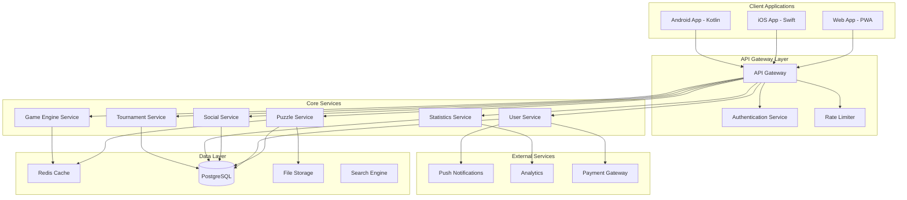

# Design Document

## Overview

The Sudoku Platform is designed as a comprehensive, cross-platform application that delivers a chess.com-like experience for Sudoku enthusiasts. The architecture follows a microservices approach with a shared core engine, platform-specific clients, and cloud-based synchronization services.

### Key Design Principles

- **Cross-Platform Consistency**: Shared business logic with platform-specific UI implementations
- **Offline-First**: Full functionality without internet connectivity
- **Scalable Architecture**: Microservices design supporting millions of concurrent users
- **Performance-Optimized**: Sub-100ms response times for all user interactions
- **Accessibility-First**: WCAG 2.1 AA compliance across all platforms

## Architecture

### High-Level System Architecture



### Client Architecture Pattern

Each platform follows a clean architecture pattern with the following layers:

1. **Presentation Layer**: Platform-specific UI components
2. **Application Layer**: Use cases and application logic
3. **Domain Layer**: Core business entities and rules
4. **Infrastructure Layer**: Data access and external service integration
## C
omponents and Interfaces

### Core Game Engine

The game engine is the heart of the application, responsible for puzzle generation, validation, and game state management.

#### Puzzle Generator Component
- **Interface**: `IPuzzleGenerator`
- **Responsibilities**: 
  - Generate unique puzzles with guaranteed single solutions
  - Support multiple puzzle variants (Classic, Killer, X-Sudoku, etc.)
  - Difficulty calibration using constraint satisfaction algorithms
- **Key Methods**:
  - `generatePuzzle(difficulty: Difficulty, variant: PuzzleVariant): Puzzle`
  - `validateUniqueSolution(puzzle: Puzzle): boolean`
  - `calculateDifficulty(puzzle: Puzzle): DifficultyScore`

#### Game State Manager
- **Interface**: `IGameStateManager`
- **Responsibilities**:
  - Track puzzle progress and user moves
  - Handle undo/redo operations
  - Manage timer state and pause functionality
- **Key Methods**:
  - `makeMove(position: Position, value: number): MoveResult`
  - `undo(): GameState`
  - `redo(): GameState`
  - `pauseTimer(): void`
  - `resumeTimer(): void`

#### Solver Engine
- **Interface**: `ISolverEngine`
- **Responsibilities**:
  - Provide intelligent hints based on solving techniques
  - Validate user solutions
  - Generate step-by-step solution paths
- **Key Methods**:
  - `getHint(gameState: GameState, hintType: HintType): Hint`
  - `validateMove(position: Position, value: number): ValidationResult`
  - `getSolutionPath(puzzle: Puzzle): SolutionStep[]`

### User Management System

#### User Profile Service
- **Interface**: `IUserProfileService`
- **Responsibilities**:
  - Manage user accounts and authentication
  - Store user preferences and settings
  - Handle subscription and payment status
- **Key Methods**:
  - `createUser(userData: UserData): User`
  - `updatePreferences(userId: string, preferences: UserPreferences): void`
  - `getSubscriptionStatus(userId: string): SubscriptionStatus`

#### Statistics Tracker
- **Interface**: `IStatisticsTracker`
- **Responsibilities**:
  - Track solving statistics and performance metrics
  - Calculate ELO ratings
  - Generate achievement progress
- **Key Methods**:
  - `recordSolve(userId: string, puzzle: Puzzle, solveTime: number): void`
  - `calculateRating(userId: string, puzzleDifficulty: number, solveTime: number): number`
  - `getAchievementProgress(userId: string): Achievement[]`

### Social and Competition System

#### Leaderboard Service
- **Interface**: `ILeaderboardService`
- **Responsibilities**:
  - Maintain global and friend leaderboards
  - Handle tournament rankings
  - Process daily challenge results
- **Key Methods**:
  - `updateLeaderboard(userId: string, score: Score): void`
  - `getLeaderboard(type: LeaderboardType, timeframe: Timeframe): LeaderboardEntry[]`
  - `getTournamentRankings(tournamentId: string): TournamentRanking[]`

#### Social Interaction Manager
- **Interface**: `ISocialManager`
- **Responsibilities**:
  - Manage friend relationships
  - Handle puzzle sharing
  - Facilitate community discussions
- **Key Methods**:
  - `addFriend(userId: string, friendId: string): void`
  - `sharePuzzle(puzzle: Puzzle, message: string): ShareLink`
  - `createForumPost(userId: string, content: ForumPost): void`

### Cross-Platform Synchronization

#### Sync Engine
- **Interface**: `ISyncEngine`
- **Responsibilities**:
  - Synchronize game progress across devices
  - Handle offline data reconciliation
  - Manage conflict resolution
- **Key Methods**:
  - `syncUserData(userId: string): SyncResult`
  - `resolveConflicts(localData: UserData, remoteData: UserData): UserData`
  - `queueOfflineChanges(changes: Change[]): void`

#### Offline Storage Manager
- **Interface**: `IOfflineStorageManager`
- **Responsibilities**:
  - Cache puzzles for offline play
  - Store user progress locally
  - Manage local database operations
- **Key Methods**:
  - `cachePuzzles(puzzles: Puzzle[]): void`
  - `getOfflinePuzzles(count: number): Puzzle[]`
  - `storeGameProgress(gameState: GameState): void`## Da
ta Models

### Core Entities

#### Puzzle Model
```typescript
interface Puzzle {
  id: string;
  variant: PuzzleVariant; // Classic, Killer, X-Sudoku, etc.
  difficulty: Difficulty; // Beginner, Easy, Medium, Hard, Expert
  size: PuzzleSize; // 6x6, 9x9, 16x16
  initialState: number[][]; // Starting puzzle grid
  solution: number[][]; // Complete solution
  constraints: Constraint[]; // Additional rules for variants
  metadata: PuzzleMetadata;
  createdAt: Date;
  difficultyScore: number;
}

interface PuzzleMetadata {
  estimatedSolveTime: number;
  techniques: SolvingTechnique[];
  rating: number;
  playCount: number;
  averageSolveTime: number;
}
```

#### Game State Model
```typescript
interface GameState {
  puzzleId: string;
  userId: string;
  currentGrid: CellState[][];
  moveHistory: Move[];
  startTime: Date;
  pausedTime: number;
  isCompleted: boolean;
  hintsUsed: number;
  mistakeCount: number;
  pencilMarks: PencilMark[][];
}

interface CellState {
  value: number | null;
  isGiven: boolean;
  isError: boolean;
  candidates: number[];
}

interface Move {
  position: Position;
  previousValue: number | null;
  newValue: number | null;
  timestamp: Date;
  moveType: MoveType; // Value, PencilMark, Clear
}
```

#### User Model
```typescript
interface User {
  id: string;
  email: string;
  username: string;
  profile: UserProfile;
  preferences: UserPreferences;
  subscription: SubscriptionInfo;
  statistics: UserStatistics;
  achievements: Achievement[];
  friends: string[]; // User IDs
  createdAt: Date;
  lastActiveAt: Date;
}

interface UserProfile {
  displayName: string;
  avatar: string;
  country: string;
  timezone: string;
  preferredLanguage: string;
}

interface UserPreferences {
  theme: Theme; // Light, Dark, Colorful
  soundEnabled: boolean;
  hintsEnabled: boolean;
  errorHighlighting: boolean;
  autoFillCandidates: boolean;
  gestureControls: boolean;
}

interface UserStatistics {
  totalPuzzlesSolved: number;
  currentStreak: number;
  longestStreak: number;
  averageSolveTime: { [key in Difficulty]: number };
  bestTimes: { [key in Difficulty]: number };
  currentRating: number;
  ratingHistory: RatingEntry[];
  accuracyRate: number;
}
```

#### Tournament Model
```typescript
interface Tournament {
  id: string;
  name: string;
  description: string;
  startDate: Date;
  endDate: Date;
  puzzles: string[]; // Puzzle IDs
  participants: TournamentParticipant[];
  prizes: Prize[];
  rules: TournamentRules;
  status: TournamentStatus;
}

interface TournamentParticipant {
  userId: string;
  score: number;
  completedPuzzles: number;
  totalTime: number;
  rank: number;
}
```

### Database Schema Design

#### Primary Tables
- **users**: User account information and preferences
- **puzzles**: Puzzle definitions and metadata
- **game_sessions**: Active and completed game states
- **user_statistics**: Performance metrics and ratings
- **achievements**: Achievement definitions and user progress
- **tournaments**: Tournament information and results
- **social_connections**: Friend relationships and interactions
- **leaderboards**: Ranking data for various timeframes

#### Indexing Strategy
- **Performance Indexes**: User ID, Puzzle difficulty, Tournament dates
- **Search Indexes**: Username, Puzzle metadata, Achievement names
- **Composite Indexes**: User-Puzzle combinations, Leaderboard rankings

## Error Handling

### Error Categories

#### Client-Side Errors
- **Validation Errors**: Invalid moves, malformed input
- **Network Errors**: Connection timeouts, offline scenarios
- **Storage Errors**: Local database failures, cache issues

#### Server-Side Errors
- **Authentication Errors**: Invalid tokens, expired sessions
- **Business Logic Errors**: Invalid game states, rule violations
- **System Errors**: Database failures, service unavailability

### Error Recovery Strategies

#### Graceful Degradation
- **Offline Mode**: Continue gameplay with cached puzzles
- **Reduced Functionality**: Disable social features when services are down
- **Local Fallbacks**: Use local storage when cloud sync fails

#### User Experience
- **Clear Error Messages**: User-friendly explanations of issues
- **Retry Mechanisms**: Automatic retry for transient failures
- **Progress Preservation**: Never lose user progress due to errors

## Testing Strategy

### Unit Testing
- **Core Logic**: Puzzle generation, solving algorithms, validation
- **Business Rules**: Scoring, rating calculations, achievement logic
- **Data Models**: Serialization, validation, transformations

### Integration Testing
- **API Endpoints**: Service communication and data flow
- **Database Operations**: CRUD operations and transactions
- **Cross-Platform Sync**: Data consistency across devices

### End-to-End Testing
- **User Workflows**: Complete puzzle solving sessions
- **Cross-Platform**: Sync verification across web, iOS, Android
- **Performance**: Load testing with concurrent users

### Platform-Specific Testing
- **Web**: Browser compatibility, PWA functionality
- **iOS**: Device-specific UI, App Store compliance
- **Android**: Material Design guidelines, Play Store requirements

### Accessibility Testing
- **Screen Readers**: VoiceOver (iOS), TalkBack (Android), NVDA (Web)
- **Color Contrast**: WCAG 2.1 AA compliance
- **Keyboard Navigation**: Full functionality without mouse/touch
- **Font Scaling**: Support for large text sizes